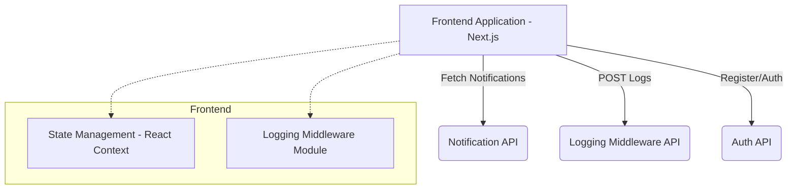

# Campus Notification System Design

## Overview
This document outlines the design and architecture of the Campus Notification System, specifically focusing on the frontend and the data handling mechanisms.

## Priority Algorithm

The system prioritizes incoming notifications to ensure critical information is surfaced to the user first. 

### Rules:
1. **Type Priority:** `Result` > `Placement` > `Event`
   - **Result:** Highest priority (e.g., Exam grades, pass/fail status).
   - **Placement:** Medium priority (e.g., Job offers, interview schedules).
   - **Event:** Lowest priority (e.g., Campus gatherings, webinars).
2. **Timestamp Priority:** Within the same type, newer notifications (most recent timestamp) are given higher priority.

### Sorting Logic
```javascript
const typePriority = {
  Result: 3,
  Placement: 2,
  Event: 1
};

notifications.sort((a, b) => {
  // 1. Sort by Type Priority
  if (typePriority[a.type] !== typePriority[b.type]) {
    return typePriority[b.type] - typePriority[a.type];
  }
  // 2. Sort by Timestamp (Newer first)
  return new Date(b.timestamp).getTime() - new Date(a.timestamp).getTime();
});
```

## Data Handling Approach
- **No Database Persistence:** The frontend does not persist notifications in a local database. Data is maintained in application state (Context API) and fetched from the backend API.
- **Top N Filtering:** The Dashboard view applies the priority sorting algorithm to all fetched unread notifications and extracts the Top N (e.g., 10) for immediate visibility.
- **Handling New Notifications:**
  - The application employs a polling mechanism (or simulated WebSocket) to periodically fetch new notifications.
  - When new notifications arrive, they are merged with the existing state, re-sorted using the priority algorithm, and the UI automatically updates.
  - A global toast/snackbar mechanism intercepts incoming notifications and displays a brief alert to the user.

## System Architecture


